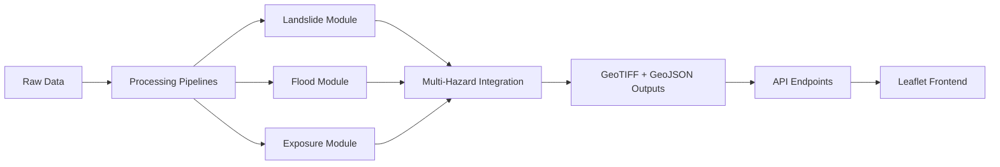

# 🗻 Pokhara Multi-Hazard Monitoring & Web Visualization System

A comprehensive geospatial application for multi-hazard monitoring, analysis, and visualization in Pokhara, Nepal. This system integrates **landslide susceptibility modeling**, **flood mapping**, and **exposure analysis** into a unified risk assessment platform with a modern web-based visualization interface.


---

## 📋 Table of Contents

- [System Overview](#system-overview)
- [Features](#features)
- [Technology Stack](#technology-stack)
- [Architecture](#architecture)
- [Installation](#installation)
- [Data Requirements](#data-requirements)
- [Usage](#usage)
- [API Documentation](#api-documentation)
- [Frontend Guide](#frontend-guide)
- [Multi-Hazard Integration](#multi-hazard-integration)
- [Troubleshooting](#troubleshooting)

---

## 🎯 System Overview

The Pokhara Multi-Hazard Monitoring System provides:

1. **Landslide Susceptibility Analysis**: ML-based (Random Forest/XGBoost) modeling using terrain features
2. **Flood Mapping**: Sentinel-1 SAR-based flood detection with DEM masking
3. **Exposure Analysis**: Building/population overlay on hazard zones
4. **Multi-Hazard Risk Integration**: Weighted combination of all hazards
5. **Web Visualization**: Interactive Leaflet.js map with layer controls

---

## ✨ Features

### Backend (FastAPI + Python)

- ✅ **ML-based Landslide Modeling**: Random Forest/XGBoost with DEM-derived features
- ✅ **SAR Flood Detection**: Otsu/manual thresholding with morphological cleanup
- ✅ **Exposure Heatmaps**: Rasterized buildings + population density
- ✅ **Multi-Hazard Integration**: Normalized weighted combination
- ✅ **RESTful API**: JSON/GeoJSON endpoints for all operations
- ✅ **Cloud-Optimized GeoTIFF**: Efficient raster storage
- ✅ **Automatic Colormap Application**: PNG previews with hazard-specific colors

### Frontend (Leaflet.js)

- ✅ **Interactive Map**: Zoom, pan, basemap switching
- ✅ **Dynamic Layer Loading**: Fetch GeoJSON from API
- ✅ **Feature Popups**: Click features to view details
- ✅ **Legend & Info Panel**: Real-time layer information
- ✅ **Modern UI**: Glassmorphism design with dark theme
- ✅ **Responsive Layout**: Mobile and desktop support

---

## 🛠️ Technology Stack

| Component | Technology |
|-----------|-----------|
| **Backend Framework** | FastAPI 0.104+ |
| **Geospatial Processing** | rasterio, geopandas, GDAL |
| **Machine Learning** | scikit-learn, XGBoost |
| **Image Processing** | OpenCV, scikit-image |
| **Frontend** | Leaflet.js, Vanilla JS/HTML/CSS |
| **Data Format** | GeoTIFF (COG), GeoJSON |
| **Server** | Uvicorn (ASGI) |

---

## 🏗️ Architecture

### Directory Structure

```
pokhara-multi-hazard/
│
├── backend/
│   ├── api/
│   │   ├── hazard.py          # Hazard processing endpoints
│   │   ├── layers.py          # Layer management endpoints
│   │   └── preview.py         # Raster visualization endpoints
│   │
│   ├── processing/
│   │   ├── landslide/
│   │   │   ├── feature_extraction.py
│   │   │   ├── model.py
│   │   │   └── pipeline.py
│   │   ├── flood/
│   │   │   ├── sar_processing.py
│   │   │   └── pipeline.py
│   │   ├── exposure/
│   │   │   ├── analysis.py
│   │   │   └── pipeline.py
│   │   ├── utils/
│   │   │   ├── raster_utils.py
│   │   │   └── geojson_utils.py
│   │   └── multi_hazard.py
│   │
│   ├── models/                # Trained ML models
│   ├── main.py               # FastAPI application
│   └── config.py             # Configuration
│
├── data/
│   ├── raw/                  # Input datasets
│   ├── processed/            # Intermediate outputs
│   └── outputs/              # Final results
│
├── frontend/
│   ├── index.html
│   ├── styles.css
│   └── app.js
│
├── requirements.txt
└── README.md
```

### Data Flow



---

## 📦 Installation

### Prerequisites

- Python 3.10 or higher
- GDAL system libraries
- pip package manager

### Step 1: Clone Repository

```bash
git clone <repository-url>
cd multi-hazard
```

### Step 2: Create Virtual Environment

```bash
python -m venv venv
source venv/bin/activate  # On Windows: venv\Scripts\activate
```

### Step 3: Install Dependencies

```bash
pip install -r requirements.txt
```

### Step 4: Install GDAL (if not already installed)

**Ubuntu/Debian:**
```bash
sudo apt-get update
sudo apt-get install gdal-bin libgdal-dev
```

**macOS:**
```bash
brew install gdal
```

**Windows:**
Download from [GIS Internals](https://www.gisinternals.com/) or use Conda.

---

## 📊 Data Requirements

Place the following datasets in `data/raw/`:

| Dataset | Filename | Format | Source |
|---------|----------|--------|--------|
| Digital Elevation Model | `dem.tif` | GeoTIFF | SRTM 30m, ALOS PALSAR |
| Landcover Classification | `landcover.tif` | GeoTIFF | ESA WorldCover, Sentinel-2 |
| Rainfall Data | `rainfall.tif` | GeoTIFF | CHIRPS, GPM |
| Sentinel-1 SAR | `sentinel1_sar.tif` | GeoTIFF (dB) | Copernicus Hub |
| Building Footprints | `buildings.geojson` | GeoJSON | OpenStreetMap |
| Population Density | `population.tif` | GeoTIFF | WorldPop, LandScan |
| Landslide Inventory | `landslide_inventory.geojson` | GeoJSON (Points) | Field surveys, historical data |

### Download Links

- **SRTM DEM**: https://earthexplorer.usgs.gov/
- **Sentinel-1 SAR**: https://scihub.copernicus.eu/
- **ESA WorldCover**: https://worldcover2021.esa.int/
- **CHIRPS Rainfall**: https://www.chc.ucsb.edu/data/chirps
- **OSM Buildings**: https://overpass-turbo.eu/ or HOT Export Tool
- **WorldPop**: https://www.worldpop.org/

---

## 🚀 Usage

### 1. Start Backend Server

```bash
cd backend
python main.py
```

Or with uvicorn directly:

```bash
uvicorn main:app --reload --host 0.0.0.0 --port 8000
```

Server will start at **http://localhost:8000**

### 2. Access Frontend

Open browser and navigate to:
```
http://localhost:8000
```

### 3. API Documentation

Interactive API docs available at:
```
http://localhost:8000/api/docs
```

---

## 📡 API Documentation

### Hazard Processing Endpoints

#### POST `/api/hazard/landslide`

Trigger landslide susceptibility analysis.

**Request Body:**
```json
{
  "train_model": false,
  "dem_path": null,
  "landcover_path": null,
  "rainfall_path": null
}
```

**Response:**
```json
{
  "status": "success",
  "message": "Landslide susceptibility analysis complete",
  "outputs": {
    "probability": "/path/to/landslide_susceptibility_probability.tif",
    "classified_raster": "/path/to/landslide_susceptibility_classified.tif",
    "geojson": "/path/to/landslide_susceptibility_zones.geojson"
  }
}
```

---

#### POST `/api/hazard/flood`

Trigger flood mapping from SAR data.

**Request Body:**
```json
{
  "sar_path": null,
  "dem_path": null,
  "threshold": -18,
  "use_otsu": true
}
```

**Response:**
```json
{
  "status": "success",
  "message": "Flood mapping complete",
  "outputs": {
    "flood_raster": "/path/to/flood_extent.tif",
    "geojson": "/path/to/flood_extent.geojson",
    "statistics": "{...}"
  }
}
```

---

#### POST `/api/hazard/exposure`

Trigger exposure analysis.

**Request Body:**
```json
{
  "hazard_raster": "/path/to/landslide_susceptibility.tif"
}
```

---

#### POST `/api/hazard/multi_risk`

Generate composite multi-hazard risk map.

**Response:**
```json
{
  "status": "success",
  "message": "Multi-hazard risk map generated",
  "outputs": {
    "risk_raster": "/path/to/multi_hazard_risk.tif",
    "classified_raster": "/path/to/multi_hazard_risk_classified.tif",
    "geojson": "/path/to/multi_hazard_risk.geojson"
  }
}
```

---

### Layer Management Endpoints

#### GET `/api/layers/list`

List all available processed layers.

**Response:**
```json
{
  "count": 4,
  "layers": [
    {
      "name": "landslide_susceptibility_zones",
      "geojson": "/path/to/file.geojson",
      "raster": "/path/to/file.tif",
      "type": "vector",
      "feature_count": 1523
    }
  ]
}
```

---

#### GET `/api/layers/{layer_name}`

Retrieve GeoJSON for specific layer.

**Example:**
```
GET /api/layers/landslide_susceptibility_zones
```

---

### Raster Preview Endpoints

#### GET `/api/preview/raster/{layer_name}`

Get PNG preview of raster with colormap applied.

**Example:**
```
GET /api/preview/raster/landslide_susceptibility
```

Returns: PNG image

---

## 🌐 Frontend Guide

### Layer Controls

1. **Toggle Layers**: Check/uncheck boxes in sidebar to show/hide layers
2. **Basemap Selection**: Use dropdown to switch between OSM, Satellite, Terrain, Dark
3. **Feature Interaction**: Click on map features to view popup with details
4. **Legend**: Shows color coding for current hazard classification

### Keyboard Shortcuts

- `+/-`: Zoom in/out
- Arrow keys: Pan map
- Click + drag: Pan map

---

## 🔄 Multi-Hazard Integration

### Formula

The multi-hazard risk index is calculated as:

```
Risk = (w_L × L_norm) + (w_F × F_norm) + (w_E × E_norm)
```

Where:
- `L_norm`: Normalized landslide susceptibility (0-1)
- `F_norm`: Normalized flood extent (0-1)
- `E_norm`: Normalized exposure density (0-1)
- `w_L`, `w_F`, `w_E`: Weights (default: 0.4, 0.4, 0.2)

### Classification Thresholds

Risk values are classified into 5 classes:

| Class | Range | Color |
|-------|-------|-------|
| Very Low | 0.0 - 0.2 | 🟢 Green |
| Low | 0.2 - 0.4 | 🟡 Yellow |
| Moderate | 0.4 - 0.6 | 🟠 Orange |
| High | 0.6 - 0.8 | 🔴 Red |
| Very High | 0.8 - 1.0 | 🟣 Purple |

### Weights Configuration

Modify weights in `backend/config.py`:

```python
MULTI_HAZARD_CONFIG = {
    "weights": {
        "landslide": 0.4,
        "flood": 0.4,
        "exposure": 0.2,
    }
}
```

---

## 🐛 Troubleshooting

### Issue: GDAL Import Error

**Solution:**
```bash
pip install --upgrade gdal==$(gdal-config --version)
```

### Issue: XGBoost Not Available

**Solution:**
```bash
pip install xgboost
```
System will fall back to Random Forest if XGBoost unavailable.

### Issue: CORS Errors in Frontend

**Solution:** Ensure CORS is enabled in `backend/config.py`:
```python
API_CONFIG = {
    "cors_origins": ["*"]
}
```

### Issue: Layer Not Loading

**Check:**
1. Ensure data files exist in `data/raw/`
2. Run hazard pipeline to generate outputs
3. Check browser console for errors
4. Verify API endpoint returns 200 status

---

## 📄 License

MIT License - See LICENSE file for details

---

## 👥 Contributors

- System designed for Pokhara, Nepal multi-hazard monitoring
- Built with FastAPI, Leaflet.js, and open geospatial tools

---

## 📞 Support

For issues, questions, or contributions, please open an issue on the repository.

---

**Built with ❤️ for safer communities in Pokhara**
